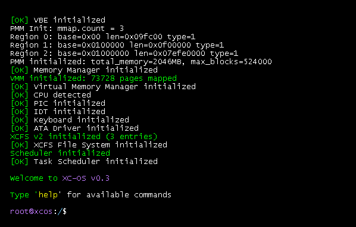
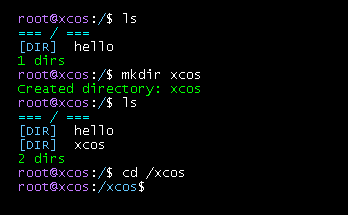
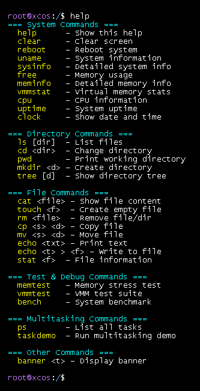

<div align="center">
<h1>XC Operating System</h1>

[](https://github.com/alx0rr/XC-OS/releases)
[](https://github.com/alx0rr/XC-OS/blob/main/LICENSE)
[](https://xc-os-website.onrender.com/)
[](https://github.com/alx0rr/XC-OS/issues)
[](https://github.com/alx0rr/XC-OS/pulls)


XC-OS — Operating System maked by alx0rr and forker-25.
This Operating System is simple and example project, which contains Custom FS(XCFS), simple VBE graphics, MMU, Kernel and Bootloader.
The OS was created for hobby purposes, so it may contain errors, bugs and other shortcomings.
Please think carefully before installing it on real hardware.

---

building the img file with build.sh:
</div>

```shell
cd project && sh build.sh
```

<div align="center">
usage with qemu:
</div>
<br>

```shell
qemu-system-x86_64   -drive file=build/xcos.img
```


<h2 align="center">Preview</h2>

<p align="center">
  
  <br><br>
  
  <br><br>
  
</p>
